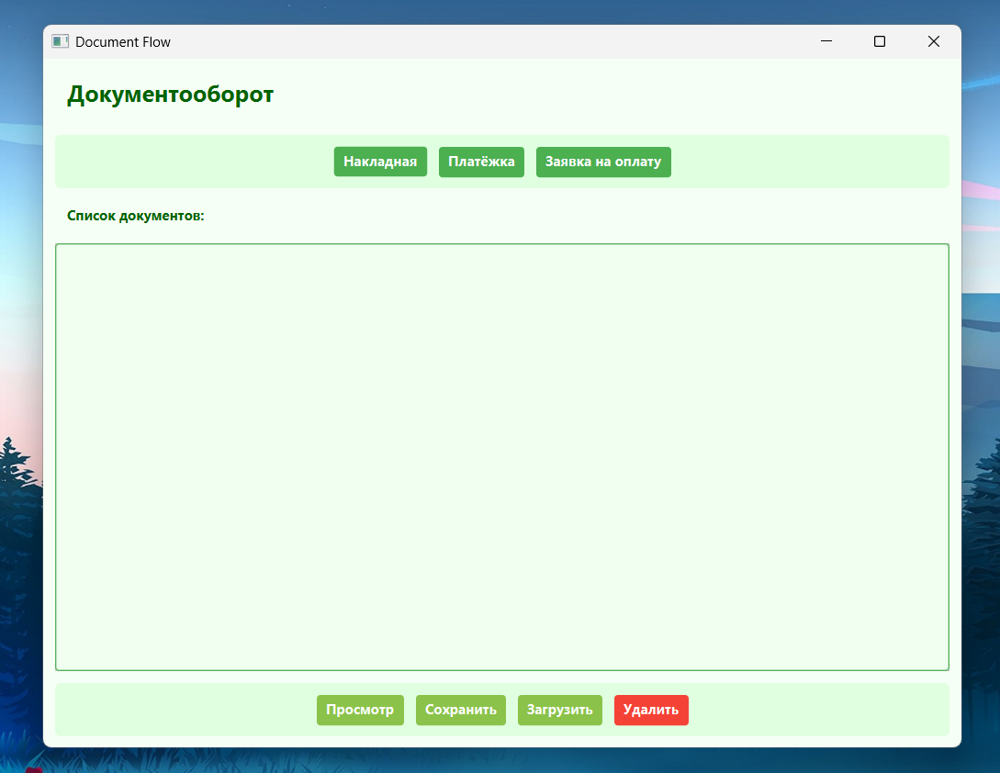
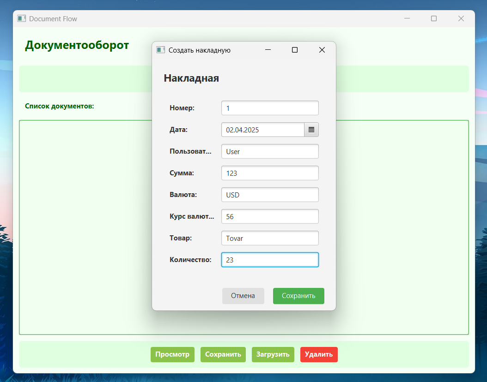
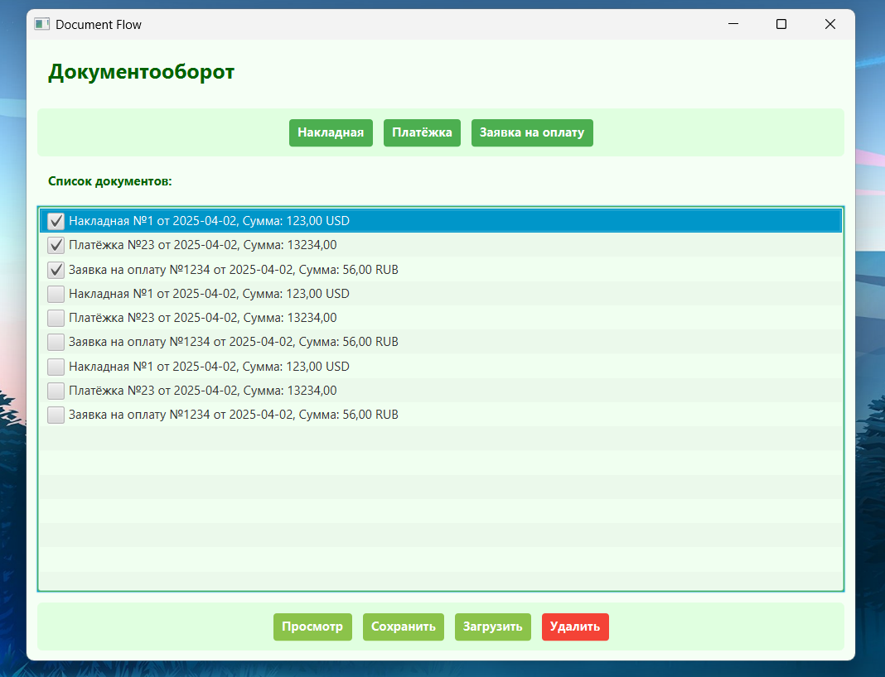
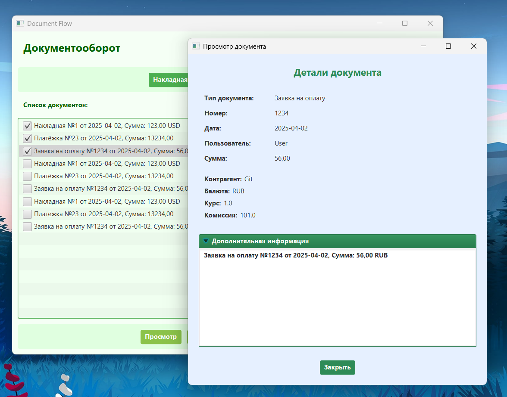

# 📂 Document Flow Management System | Система управления документооборотом


## 🌟 Основные возможности

**Document Flow** — это desktop-приложение для управления финансовыми документами, разработанное на JavaFX. 

### 📄 Управление документами

- **Создание** трех типов документов через интуитивные формы
- **Просмотр** полной информации в удобном интерфейсе
- **Пакетное удаление** с помощью чекбоксов
- **Адаптивный интерфейс** под разные разрешения экрана

### 📂 Файловые операции

- **Экспорт** документов в текстовые файлы
- **Импорт** сохраненных документов

## 🏷 Поддерживаемые типы документов

| Тип                | Ключевые атрибуты                          |
|--------------------|--------------------------------------------|
| **Накладная**      | Товар, Количество, Валюта, Курс            |
| **Платёжка**       | Сумма, Сотрудник                           |
| **Заявка на оплату**| Контрагент, Комиссия, Валютные операции   |

## 🚀 Быстрый старт

```bash
git clone https://github.com/thedogthe/DocumentFlow.git
cd DocumentFlow
mvn clean install
mvn javafx:run
```

## 🏗 Структура проекта

```bash
src/
├── main/
│ ├── java/
│ │ └── com/the/documentflow/
│ │ ├── controller/ # Контроллеры для UI
│ │ │ ├── MainController.java - Главный контроллер
│ │ │ ├── InvoiceController.java - Для накладных
│ │ │ ├── PaymentController.java - Для платежек
│ │ │ └── PaymentRequestController.js - Для заявок
│ │ │
│ │ └── model/ # Модели данных
│ │ ├── Document.java - Базовый класс
│ │ ├── Invoice.java - Накладная
│ │ ├── Payment.java - Платёжка
│ │ └── PaymentRequest.java - Заявка
```

## 🛠 Технологический стек

Java 21+ - ядро приложения

JavaFX - графический интерфейс

Maven - система сборки

## 🖥 Примеры интерфейса









## TODO

Fix warnings, replace document store to Db, add docs
